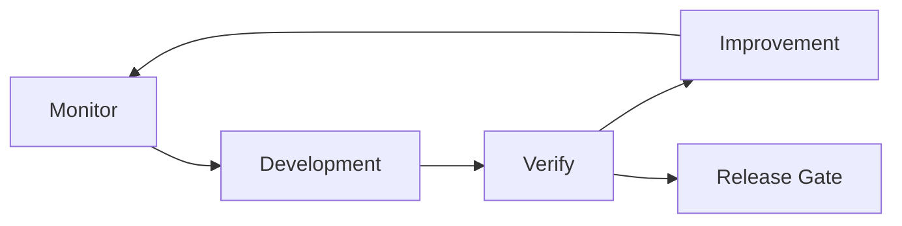
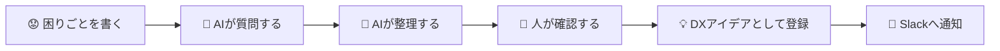
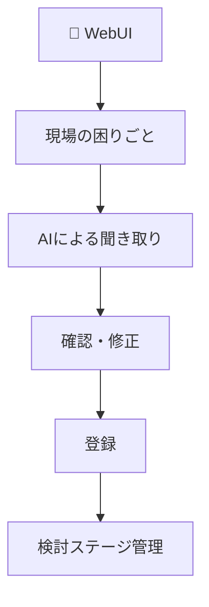
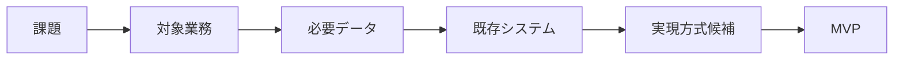
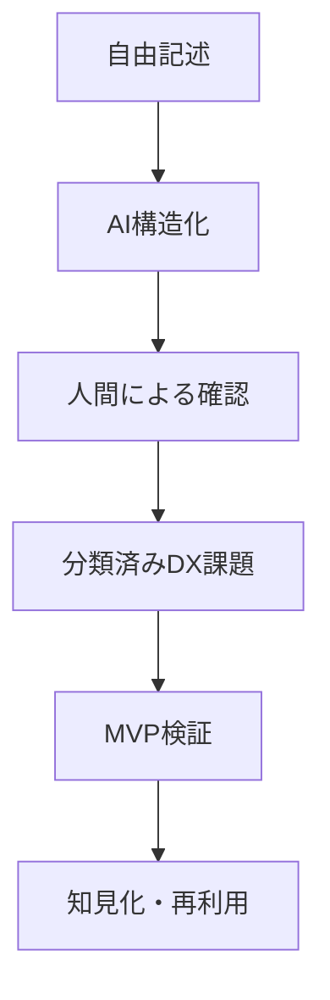
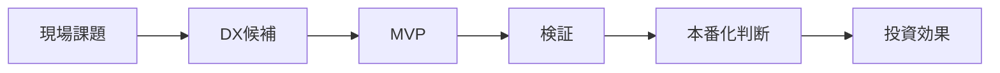
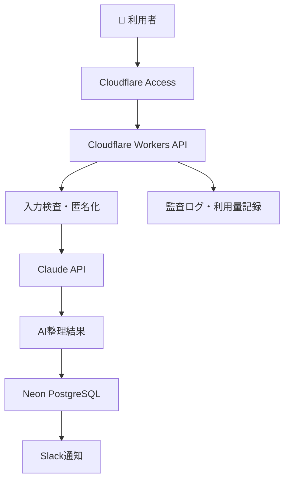
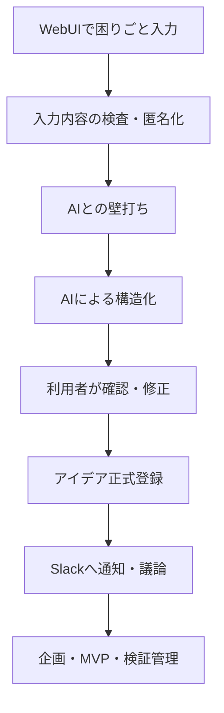
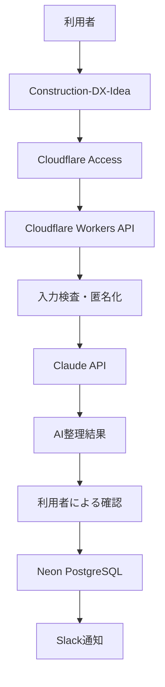
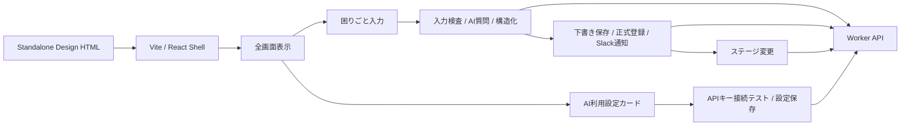

# 🏗️ Construction-DX-Idea

## 🤖 AI活用型DXアイデア管理システム構想


`Construction-DX-Idea` は、土木建設の現場・技術・管理業務で出てくる「困りごと」を、AIとの壁打ちで整理し、DXアイデアとして登録・評価・進捗管理するためのWebシステム構想です。

> **基本方針:** 入力・AI整理・進捗管理は `Construction-DX-Idea`、周知・議論は Slack で行います。

---

## 🚦 現在の実装ステータス

| 領域 | 状態 | 実装内容 |
|---|---|---|
| 🖥️ WebUI | デザイン適用済み / 主要機能ブリッジ済み | `Construction DX Idea (standalone).html` を正本として100%表示。困りごと入力、入力検査、AI質問、構造化、下書き保存、正式登録、ステージ変更、AI設定をWorker APIへ接続 |
| ⚙️ Backend API | 実装済み | Cloudflare Workers + Hono API、Cloudflare Access JWT検証、AI利用制御、監査ログ、Slack通知・再送 |
| 🗄️ Database | 実装済み | Neon PostgreSQL向け初期SQLマイグレーション |
| 🤖 AI連携 | 実装済み | Claude API呼び出し、最大3問の質問生成、構造化、プロンプトバージョン記録 |
| 🔐 Security | 実装済み | Secret分離、Access JWT検証、AI接続テスト、入力検査、マスキング、利用上限、ログ秘匿、ローカルSecretスキャン |
| 🧪 Verify | 通過 | `npm run verify`、`npm run worker:deploy:dry-run`、CORS/ロール判定テスト、Secretスキャン |
| 🌐 Release | 進行中 | 本番公開先を `https://dxidea.mirai-dx-platform.com` 前提に整備中。wrangler設定、`.env.example`、Release Runbook更新済み |
| 📌 GitHub Projects | 更新済み | [Construction-DX-Idea 開発司令盤](https://github.com/users/Kensan196948G/projects/42) |



## 🚀 ローカル起動

```bash
npm install
npm run dev
```

起動後、表示された `http://<IPアドレス>:<ポート番号>/` を開きます。ローカルWebUIは初期状態ではモックAPIで動作します。

### 検証コマンド

| コマンド | 内容 |
|---|---|
| `npm run lint` | TypeScript/React/Workerの静的検査 |
| `npm run test` | 入力検査・マスキングのテスト |
| `npm run build` | TypeScriptビルドとVite本番ビルド |
| `npm run build:production-api` | モックを無効化した本番API向けビルド |
| `npm run security:scan` | Secret混入の簡易検査 |
| `npm run verify` | lint、test、通常build、本番API build、security scanを一括実行 |
| `npm run worker:deploy:dry-run` | Cloudflare Workerのデプロイ直前dry-run |
| `npm run predeploy:check` | 本番環境値のplaceholder、モックAPI、Access設定漏れを検査 |
| `npm run release:prepare` | 本番向けprepare（ビルド+predeploy+dry-run） |
| `npm run release:deploy` | 本番デプロイ（Worker + Frontend） |

---

## 👥 1. 非エンジニア向け

このシステムは、難しいDX用語を知らなくても使える「困りごと投稿・整理ツール」です。

利用者は、まず「何に困っているか」をWeb画面に入力します。AIが追加で質問し、内容を「課題」「対象業務」「改善案」「期待効果」「MVP案」などに整理します。最後は必ず人が確認してから登録します。



---

## 👷 2. 土木建設現場管理者向け

現場で起きている「紙が多い」「Excel転記が多い」「写真整理が大変」「報告が二重入力になる」といった問題を、現場目線のまま登録できます。

登録時に求めるのは、完成した解決策ではありません。現場の事実です。

| 入力すること | 例 |
|---|---|
| どの仕事で困っているか | 出来形写真の整理、日報作成、協力会社への連絡 |
| 誰が困っているか | 現場代理人、主任技術者、測量担当、事務担当 |
| 今のやり方 | 紙、Excel、写真フォルダ、既存システム |
| 改善したい状態 | 転記を減らしたい、探す時間を短くしたい、共有漏れをなくしたい |



---

## 🧑‍💼 3. 土木建設技術者向け

技術者は、登録されたアイデアを業務・データ・実現方式の観点から検討できます。

AIは、以下の整理を支援します。

- 対象業務の分類
- 現行手順の分解
- 使用データの整理
- 既存システムとの関係整理
- MVP候補と終点の提案
- セキュリティ上の注意点の抽出



---

## 🔬 4. 土木建設研究者向け

本システムは、建設DXの課題収集・分類・検証テーマ化にも利用できます。

蓄積されるデータは、単なる自由記述ではなく、AIと人間の確認を経た構造化データです。将来的には、業務領域別のDX課題分析、投資対効果の仮説検証、MVP成功条件の分析に活用できます。



---

## 🏢 5. 会社経営層向け

経営層にとっての目的は、現場発のDXアイデアを「見える化」し、投資判断できる状態にすることです。

| 経営上の関心 | システムで見えること |
|---|---|
| どの業務に課題が多いか | 業務分類別の登録数 |
| 投資すべきテーマは何か | 効果見込み、対象人数、頻度 |
| MVPは進んでいるか | 企画、MVP、検証、本番化ステージ |
| リスクは管理されているか | セキュリティ注意、承認履歴、監査ログ |
| AI利用コストは制御できるか | 利用上限、使用量、停止スイッチ |



---

## 🛡️ 6. 社内IT部門スタッフ向け

社内IT部門は、AI接続、認証、データ管理、セキュリティ、監査、コスト制御を担当します。



### 🔐 APIキー管理原則

| 保管場所 | 方針 |
|---|---|
| WebUI JavaScript | 禁止 |
| HTML・設定ファイル | 禁止 |
| GitHub | 禁止 |
| Neon PostgreSQL | APIキー本体は禁止 |
| Cloudflare Worker Secret | MVPで推奨 |
| Cloudflare Secrets Store | 運用版で推奨 |

---

## 🧭 全体フロー



## 🧱 システム構成



## 🧩 主要機能

| アイコン | 機能 | 内容 |
|---|---|---|
| 📝 | 困りごと入力 | 解決策ではなく現場の課題を入力 |
| 🤖 | AI壁打ち | 不足情報を最大3問ずつ質問 |
| 🧱 | 構造化 | 課題、対象業務、改善案、MVP案へ整理 |
| ✅ | 人間確認 | AI結果を修正・再検討・登録 |
| 📣 | Slack通知 | MVPでは新規登録通知と失敗時Outbox再送。承認依頼・週次共有はPhase 2 |
| 📊 | 進捗管理 | MVPではステージ管理。詳細な効果測定・承認ワークフローはPhase 2 |
| 🔐 | 機密管理 | APIキーをCloudflare Secretで管理 |
| 🧾 | 監査ログ | AI利用、承認、設定変更を記録 |
| ⚙️ | AI設定管理 | モデル、有効/無効、利用上限、APIキー接続テスト、設定保存を管理 |

## 🧪 現在のWebUI実装メモ



| 画面領域 | 現在の状態 | 次の実装判断 |
|---|---|---|
| 🎨 全体UI | 提供されたstandaloneデザインを正本として表示 | デザイン差分が出ないよう維持 |
| ⚙️ AI利用設定 | APIキー入力、保存済みSecret接続テスト、設定保存をAPIへ接続 | Secret本体保存はMVP方針どおりCloudflare手動登録 |
| 📝 困りごと登録 | 入力検査、AI質問、構造化、手動フォールバックをAPIへ接続 | 本番E2EでClaude実接続確認が必要 |
| 📋 一覧・詳細 | `GET /api/ideas` の実データ表示へ接続 | API取得失敗時は警告し再試行 |
| 🗂️ ステージ管理 | `/api/ideas/:id/stage` へ接続 | 管理者ロール以外はUI操作時点で停止 |

## 📌 MVPの終点

> 複数の利用者がWebUIから困りごとを入力し、Claude APIによる整理結果を本人が確認・修正して正式登録できること。登録結果がSlackへ通知され、管理者がアイデアの検討ステージを管理できること。

## 📚 開発ドキュメント

詳細な要件・仕様・運用文書は [`docs/README.md`](docs/README.md) から参照できます。

主要文書:

- [`docs/01_requirements_definition.md`](docs/01_requirements_definition.md)
- [`docs/02_detailed_spec_webui_ai_wizard.md`](docs/02_detailed_spec_webui_ai_wizard.md)
- [`docs/03_detailed_spec_api_data_infra.md`](docs/03_detailed_spec_api_data_infra.md)
- [`docs/09_security_privacy.md`](docs/09_security_privacy.md)
- [`docs/11_test_strategy.md`](docs/11_test_strategy.md)
- [`docs/21_autonomous_cto_execution.md`](docs/21_autonomous_cto_execution.md)
- [`docs/22_current_implementation_status.md`](docs/22_current_implementation_status.md)
- [`docs/23_release_deploy_runbook.md`](docs/23_release_deploy_runbook.md)

## ✅ 結論

`Construction-DX-Idea` は、現場の困りごとを起点に、AIで整理し、人間が確認し、DXアイデアとして継続管理する仕組みです。

**WebUIで困りごと入力 → 入力検査・匿名化 → AIとの壁打ち・構造化 → 人間による確認 → アイデア登録 → Slackへ通知・議論 → 企画・MVP・検証管理**
