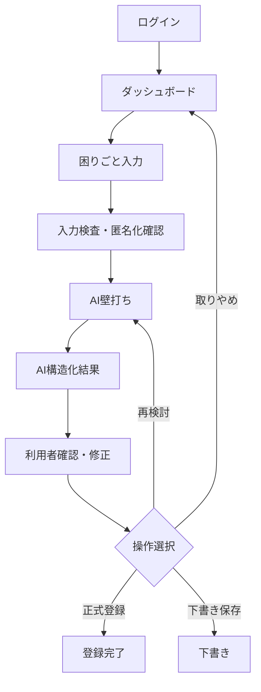

# 詳細仕様設計書 WebUI・AIウィザード編

## 1. 目的

本書は、困りごと入力からAI壁打ち、AI構造化、利用者確認、正式登録までのWebUI詳細仕様を定義する。

## 2. 画面構成

## 3. 画面1 困りごとの入力

### 入力項目

| 項目 | 必須 | 入力形式 | 備考 |
|---|---:|---|---|
| 困っている仕事 | 必須 | 複数行テキスト | 解決策ではなく現状を書く |
| 困っている人 | 任意 | テキスト/選択 | 職種や役割で記載 |
| 現在の作業方法 | 必須 | 複数行テキスト | 紙、Excel、既存システムなど |
| 改善したい状態 | 必須 | 複数行テキスト | どうなればよいか |
| 使用中のデータ | 任意 | 複数行テキスト | ファイル名や形式まで |
| 関連システム | 任意 | テキスト | 既存システム名 |
| 機密情報の可能性 | 必須 | ラジオ | あり/なし/不明 |

### バリデーション

- 必須項目未入力は次へ進めない。
- 1項目あたりの最大文字数は2,000文字とし、WebUIとWorker APIの両方で必須チェックする。
- 文字数超過時はAI処理と保存処理へ進めず、APIは `AI_INPUT_TOO_LARGE` 相当のエラーを返す。
- メールアドレス、社員番号、IPアドレス、案件番号らしき文字列を検出した場合は警告する。

## 4. 画面2 入力検査・匿名化確認

検出した機密情報候補を表示し、利用者に修正またはマスキングを促す。

| 検出対象 | UI動作 |
|---|---|
| メールアドレス | `[メールアドレス]` への置換候補 |
| 個人名候補 | 警告表示、利用者が修正 |
| 工事名・案件番号候補 | 警告表示、マスキング候補 |
| 契約金額 | AI送信非推奨として警告 |

MVPでは自動判定の誤検知を考慮し、最終的な修正判断は利用者に委ねる。

## 5. 画面3 AIとの壁打ち

AIは不足情報を最大3問提示する。

### 質問生成ルール

- 既に入力済みの内容を再質問しない。
- 頻度、作業時間、関係者、使用データ、共有先を優先する。
- 個人情報や会社固有情報を直接求めない。
- 1ターン最大3問まで。
- 利用者は「わからない」「後で確認」を選択できる。

### UI操作

| 操作 | 内容 |
|---|---|
| 回答する | 質問に回答して次のAI処理へ進む |
| スキップ | 未回答として構造化へ進む |
| 入力内容を修正 | 前画面へ戻る |
| AI利用をやめる | 手動登録フローへ切り替える |

AI機能が無効、利用上限到達、Claude API障害、AI応答形式不正の場合は、利用者が「AIを使わず確認へ」を選び、入力内容から手動確認用の構造化下書きを作成できる。

## 6. 画面4 AIによる構造化

AIは以下のJSON相当の構造へ整理する。

| 項目 | 内容 |
|---|---|
| title_candidates | アイデア名候補 |
| current_issue | 現在の課題 |
| target_business | 対象業務 |
| target_users | 対象利用者 |
| current_workflow | 現行手順 |
| improvement_idea | 改善案 |
| expected_effects | 期待効果 |
| required_data | 必要なデータ |
| related_systems | 関連する既存システム |
| implementation_options | 実現方式候補 |
| security_notes | セキュリティ上の注意 |
| open_questions | 未確認事項 |
| mvp_candidate | MVP候補 |
| mvp_done_definition | MVPの終点 |

## 7. 画面5 利用者確認

利用者はAI整理結果をそのまま登録せず、必ず確認する。

### 操作

| 操作 | 結果 |
|---|---|
| 内容を修正する | 編集モードに入る |
| AIと再検討する | AI壁打ちへ戻る |
| 下書きとして保存 | `draft` 状態で保存 |
| 正式に登録する | `submitted` 状態で保存しSlack通知 |
| 登録を取りやめる | 保存せず終了または下書き破棄 |

## 8. ステータス

| 状態 | 意味 |
|---|---|
| draft | 下書き |
| submitted | 正式登録 |
| planning | 企画中 |
| mvp | MVP開発中 |
| verification | 検証中 |
| production_candidate | 本番化候補 |
| production | 本番運用 |
| rejected | 却下 |
| archived | 保管 |

## 9. エラー表示

| 状況 | 表示方針 |
|---|---|
| AI無効 | 手動入力で継続可能と案内 |
| AI接続エラー | 下書き保存を促す |
| 利用上限到達 | 翌日または管理者へ相談と表示 |
| 機密情報検出 | 該当箇所の確認を促す |
| Slack通知失敗 | 登録は成功、通知のみ失敗として表示 |

## 10. アクセシビリティ

- 重要操作には確認ダイアログを表示する。
- 色だけで状態を表現しない。
- 入力項目には明確なラベルと補足を付ける。
- スマートフォン、タブレット、PCで操作できるレスポンシブUIとする。
