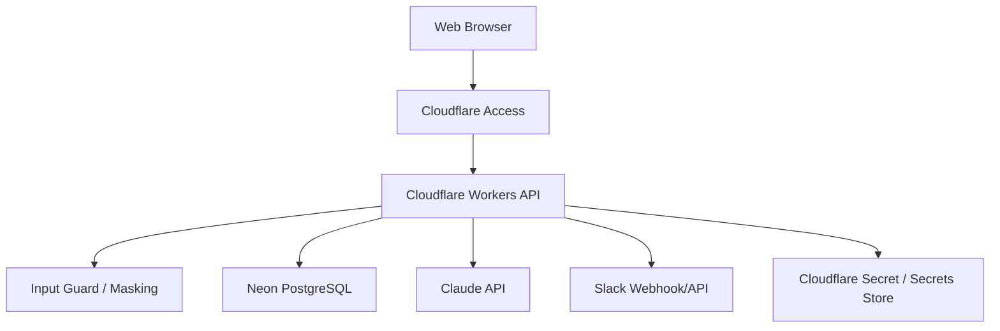
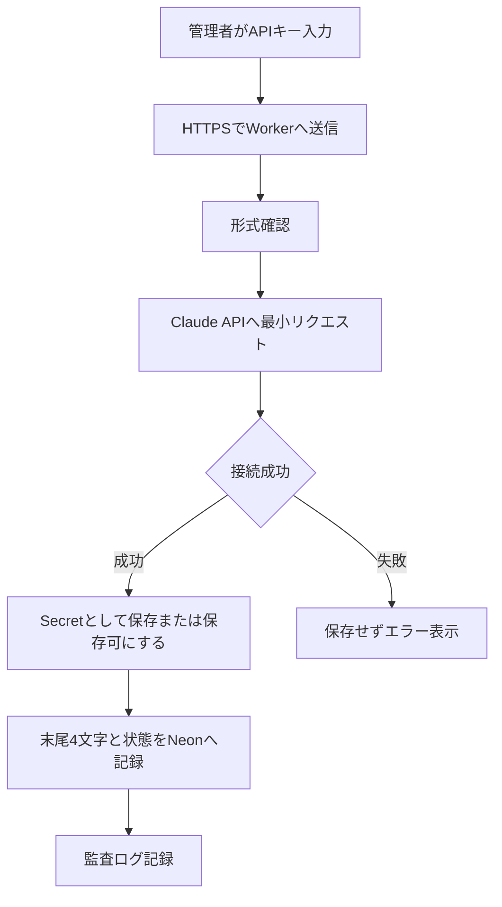

# 詳細仕様設計書 API・データ・基盤編

## 1. 目的

本書は、API（Cloudflare Workers / ローカルsystemd）、PostgreSQL、Claude API、Slack連携、Secret管理の詳細仕様を定義する。

> **2026-08-31 更新**: DBはクラウドの **Neon PostgreSQL からローカルPostgreSQLへ移行済み**。
> 現行は本番 `dx_idea` / MVP `dx_idea_mvp` を localhost の PostgreSQL 上で運用する
> （systemd + postgres.js TCP。`worker/index.ts` が接続URLのホストでNeon serverless driver と
> postgres.js を自動選択するため、neon.tech ホストを使う旧構成もコード上は動作可能）。
> 本書中の「Neon」表記は旧構成の仕様記述として残す。

## 2. 論理構成

## 3. API設計方針

- 認証済みユーザー情報はCloudflare Accessのヘッダーから取得する。
- APIキー本体はリクエスト、レスポンス、DB、ログへ出力しない。
- AI処理は利用上限、文字数、同時実行数を検査してから実行する。
- AIへ送信する前に機密情報候補を検出し、必要に応じてマスキングする。
- Slack通知失敗はアイデア登録失敗にしない。

## 4. 主要API

| メソッド | パス | 用途 | 状態 |
|---|---|---|---|
| GET | `/api/health` | 死活監視 | MVP実装済み、認証不要 |
| GET | `/api/me` | ログインユーザー情報 | MVP実装済み |
| GET | `/api/metrics` | ダッシュボード指標 | MVP実装済み |
| POST | `/api/privacy/inspect` | 入力検査 | MVP実装済み |
| POST | `/api/ideas/drafts` | 下書き保存 | MVP実装済み |
| POST | `/api/ideas` | 正式登録 | MVP実装済み |
| GET | `/api/ideas` | 一覧取得 | MVP実装済み |
| POST | `/api/ideas/:id/stage` | ステージ変更 | MVP実装済み |
| POST | `/api/ai/questions` | AI追加質問 | MVP実装済み |
| POST | `/api/ai/structure` | AI構造化 | MVP実装済み |
| GET | `/api/admin/ai-settings` | AI設定取得 | MVP実装済み |
| PATCH | `/api/admin/ai-settings` | AI設定更新 | MVP実装済み |
| POST | `/api/admin/ai-settings/test` | AI接続テスト | MVP実装済み |
| GET | `/api/ideas/:id` | 詳細取得 | Phase 2 |
| PATCH | `/api/ideas/:id` | 編集 | Phase 2 |
| GET | `/api/admin/audit-logs` | 監査ログ閲覧 | Phase 2 |
| GET | `/api/admin/usage` | AI利用量閲覧 | Phase 2 |

## 5. データ保存方針

### Neon PostgreSQLに保存する

- 利用者が確認した構造化結果
- 下書き、正式登録、ステージ
- AI処理メタデータ
- 使用モデル、入力文字数、出力文字数、成功/失敗
- 決定内容、決定理由、決定者
- APIキー末尾4文字、Secret識別名、接続状態
- 監査ログ

### Neon PostgreSQLに保存しない

- Claude APIキー本体
- 外部サービスの認証トークン本体
- AI送信前の機密情報を含む原文全文
- 添付ファイル原文

## 6. Secret管理

| 段階 | 管理方式 |
|---|---|
| MVP | Cloudflare DashboardまたはCLIでSecretを手動登録 |
| 検証版 | 管理画面で接続テストとモデル設定 |
| 運用版 | 接続テスト成功後にSecrets Storeへ保存 |
| 将来 | 複数AI、キー切替、失効、ローテーション対応 |

## 7. AI接続テスト

## 8. エラー分類

| コード | 内容 |
|---|---|
| AI_INVALID_KEY | APIキーが無効 |
| AI_PERMISSION_DENIED | APIキーの権限不足 |
| AI_MODEL_UNAVAILABLE | 指定モデルが利用できない |
| AI_BALANCE_INSUFFICIENT | 利用残高不足 |
| AI_RATE_LIMITED | レート制限 |
| AI_PROVIDER_UNREACHABLE | Claude APIへ接続できない |
| AI_TIMEOUT | タイムアウト |
| AI_DISABLED | AI機能が無効 |
| AI_BUDGET_EXCEEDED | 利用上限到達 |
| AI_RESPONSE_INVALID | AI応答JSONまたはスキーマが不正 |
| SYSTEM_CONFIG_ERROR | システム設定エラー |

## 9. Slack通知

正式登録、ステージ変更、承認依頼、MVP公開、検証開始、検証完了、週次ダイジェストを通知対象とする。

通知は `notification_outbox` にイベントID、対象リソース、冪等キー、送信状態、試行回数、次回再送予定、最終エラーを保存してから送信する。Slack Webhookへの送信に失敗してもアイデア登録は成功扱いとし、Outboxを `failed` または `pending` に残して再送対象にする。

冪等キーは `event_type:resource_type:resource_id:version` の形式を基本とし、同一イベントの二重投稿を防ぐ。再送処理はCloudflare Cron Triggersから起動し、成功時に `sent`、失敗時に試行回数と次回再送予定を更新する。Slack Webhook呼び出しにはタイムアウトを設定し、登録処理を長時間ブロックしない。

Slackの議論内容は自動で正本にしない。最終的な決定はConstruction-DX-Ideaへ意思決定記録として反映する。

## 10. 監査ログ

記録対象:

- ログインユーザー
- 操作種別
- 対象リソース
- 実行日時
- 成否
- IPまたはAccess由来の識別情報
- AI処理種別
- モデル
- 入出力文字数
- プロンプトバージョン

APIキー本体、プロンプト全文、機密情報を含む原文全文は記録しない。

監査ログは原則として3年間保持し、AI処理ログは90日経過後に利用量、処理種別、成否、モデル、プロンプトバージョンなどの統計項目だけを残して詳細メタデータを匿名化する。法務・監査要件で延長が必要な場合は、対象期間と理由を意思決定記録へ残す。
