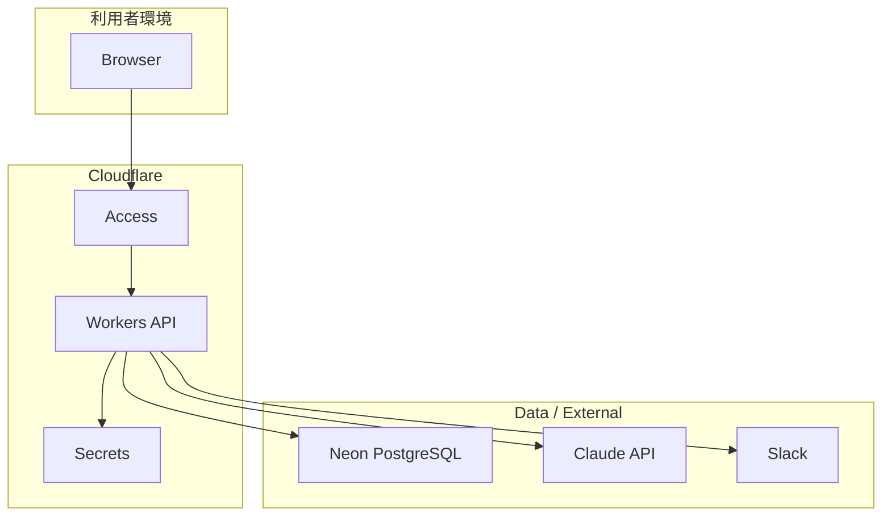

# システムアーキテクチャ設計書

## 1. アーキテクチャ方針

`Construction-DX-Idea` は、Cloudflareを入口とAPI実行基盤、Neon PostgreSQLを業務データの正本、Claude APIをAI整理機能、Slackを通知・議論基盤として利用する。

## 2. コンポーネント

| コンポーネント | 責務 |
|---|---|
| WebUI | 入力、確認、一覧、詳細、管理画面 |
| Cloudflare Access | 認証、入口制御、ユーザー識別 |
| Cloudflare Workers | API、入力検査、AI呼び出し、Slack通知 |
| Cloudflare Secret | APIキー、トークンの機密管理 |
| Claude API | 質問生成、構造化、分類、要約、MVP案 |
| Neon PostgreSQL | アイデア、履歴、承認、進捗、監査の正本 |
| Slack | 通知、議論、承認依頼、週次共有 |
| GitHub | ソース、設計書、Issue、PR、実装進捗 |

## 3. 配置図

## 4. 責務分離

- WebUIはAPIキーを扱わない。
- WorkersはAI送信前の検査と利用制御を担当する。
- Neonは業務データとメタデータの正本を保持する。
- Secret管理領域は機密情報のみを保持する。
- Slackは通知と議論に限定し、正本はアプリケーション内に残す。

## 5. 障害時方針

| 障害 | 方針 |
|---|---|
| Claude API障害 | 手動入力、下書き保存、既存閲覧は継続 |
| Slack障害 | 登録は成功扱い、通知再送対象にする |
| Neon障害 | 書き込み不可としてエラー表示 |
| Secret取得失敗 | AI機能を停止し管理者へ通知 |
| Access設定ミス | 管理者がCloudflare側で復旧 |
