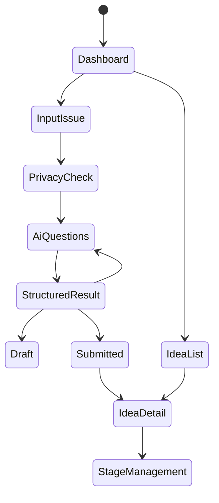

# 画面遷移・UI仕様書

## 1. 画面一覧

| ID | 画面 | 主な利用者 |
|---|---|---|
| UI-001 | ダッシュボード | 全利用者 |
| UI-002 | 困りごと入力 | 全利用者 |
| UI-003 | 入力検査・匿名化確認 | 全利用者 |
| UI-004 | AI壁打ち | 全利用者 |
| UI-005 | AI構造化結果確認 | 全利用者 |
| UI-006 | アイデア一覧 | 全利用者 |
| UI-007 | アイデア詳細 | 全利用者 |
| UI-008 | ステージ管理 | 管理者、DX部門 |
| UI-009 | AI接続設定 | システム管理者 |
| UI-010 | 利用量・監査ログ | システム管理者 |

## 2. 画面遷移

## 3. UI原則

- 最初に解決策を求めず、困りごとを入力させる。
- AI結果は必ず編集可能にする。
- 登録、削除、AI接続設定変更など重要操作は確認ダイアログを出す。
- 管理画面は一般利用者から見えない。
- 状態表示は色と文字の両方で示す。

## 4. ダッシュボード

表示項目:

- 自分の下書き
- 最近登録されたアイデア
- ステージ別件数
- AI機能の利用可否
- 新規困りごと登録ボタン

## 5. アイデア一覧

検索・絞り込み:

- キーワード
- 対象業務
- ステージ
- 登録者
- 担当者
- 登録日

## 6. アイデア詳細

表示項目:

- タイトル
- 課題
- 改善案
- 期待効果
- MVP候補
- 未確認事項
- セキュリティ注意
- ステージ履歴
- 意思決定記録
- Slack議論リンク

## 7. 管理画面

AI接続設定では保存済みAPIキーを再表示しない。表示するのは接続状態、モデル、キー末尾4文字、最終確認日時、最終更新者のみとする。
