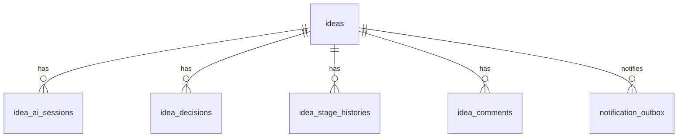

# データベース設計書

## 1. 方針

Neon PostgreSQLには、利用者が確認した構造化結果と人間の意思決定を正本として保存する。APIキー本体は保存しない。

## 2. 主要テーブル

### ideas

| カラム | 型 | 内容 |
|---|---|---|
| id | uuid | アイデアID |
| title | text | タイトル |
| current_issue | text | 現在の課題 |
| improvement_idea | text | 改善案 |
| target_business | text | 対象業務 |
| target_users | text | 対象利用者 |
| expected_effects | text | 期待効果 |
| required_data | jsonb | 必要データ |
| related_systems | jsonb | 関連システム |
| mvp_candidate | text | MVP候補 |
| mvp_done_definition | text | MVPの終点 |
| security_notes | jsonb | セキュリティ注意 |
| open_questions | jsonb | 未確認事項 |
| stage | text | ステージ |
| created_by | text | 登録者 |
| owner_id | text | 担当者 |
| created_at | timestamptz | 登録日時 |
| updated_at | timestamptz | 更新日時 |

### idea_ai_sessions

| カラム | 型 | 内容 |
|---|---|---|
| id | uuid | AIセッションID |
| idea_id | uuid | アイデアID |
| executed_by | text | 実行者 |
| process_type | text | questions/structure/summary |
| model | text | 使用モデル |
| input_chars | integer | 入力文字数 |
| output_chars | integer | 出力文字数 |
| result | text | success/failure |
| usage_cost_estimate | numeric | 概算費用 |
| prompt_version | text | プロンプトバージョン |
| input_hash | text | AI送信内容のハッシュ |
| created_at | timestamptz | 実行日時 |

### idea_decisions

| カラム | 型 | 内容 |
|---|---|---|
| id | uuid | 決定ID |
| idea_id | uuid | アイデアID |
| decision | text | 決定内容 |
| reason | text | 決定理由 |
| decided_by | text | 決定者 |
| ai_difference | text | AI提案との差異 |
| decided_at | timestamptz | 決定日時 |

### ai_settings

| カラム | 型 | 内容 |
|---|---|---|
| id | uuid | 設定ID |
| provider | text | AIプロバイダー |
| model | text | 使用モデル |
| secret_name | text | Secret識別名 |
| key_last4 | text | APIキー末尾4文字 |
| status | text | connected/error/not_configured |
| enabled | boolean | AI機能有効 |
| daily_limit | integer | 日次上限 |
| monthly_budget | numeric | 月間予算 |
| last_checked_at | timestamptz | 最終接続確認 |
| updated_by | text | 更新者 |
| updated_at | timestamptz | 更新日時 |

### audit_logs

| カラム | 型 | 内容 |
|---|---|---|
| id | uuid | 監査ログID |
| actor | text | 実行者 |
| action | text | 操作 |
| resource_type | text | 対象種別 |
| resource_id | text | 対象ID |
| result | text | 成否 |
| metadata | jsonb | 追加情報 |
| created_at | timestamptz | 実行日時 |

### notification_outbox

| カラム | 型 | 内容 |
|---|---|---|
| id | uuid | 通知イベントID |
| event_type | text | `idea.submitted` などのイベント種別 |
| resource_type | text | 対象種別 |
| resource_id | uuid | 対象ID |
| idempotency_key | text | 二重送信防止キー |
| payload | jsonb | マスキング済み通知内容 |
| status | text | pending/processing/sent/failed/skipped |
| attempts | integer | 送信試行回数 |
| next_attempt_at | timestamptz | 次回再送予定 |
| last_error | text | 機密情報を含まない最終エラー |
| created_at | timestamptz | 作成日時 |
| updated_at | timestamptz | 更新日時 |

### ai_monthly_usage_counters

| カラム | 型 | 内容 |
|---|---|---|
| subject_type | text | user/global |
| subject_id | text | 利用者メールまたは `*` |
| usage_month | date | 月初日 |
| used_cost_estimate | numeric | 当月の概算利用額 |
| budget | numeric | 適用した月次予算 |
| updated_at | timestamptz | 更新日時 |

## 3. リレーション

## 4. インデックス候補

- ideas(stage)
- ideas(created_by)
- ideas(created_at)
- idea_ai_sessions(idea_id)
- idea_ai_sessions(created_at)
- audit_logs(actor, created_at)
- audit_logs(resource_type, resource_id)
- notification_outbox(status, next_attempt_at)
- ai_monthly_usage_counters(subject_type, subject_id, usage_month)
